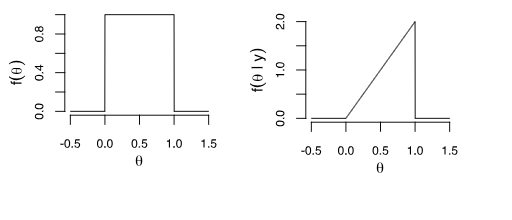
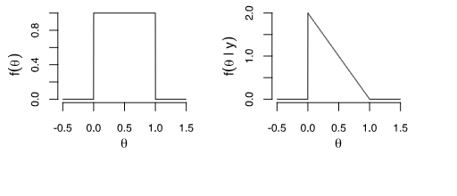
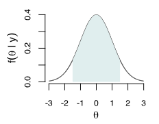
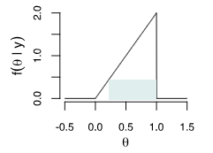

# Statistique Bayésienne: Des concepts à l'analyse des données

## 2. Inférence fréquentiste vs Bayésienne

### 2.1 Interval de confiance fréquentiste - rappel

Pour rappel dans le paradigme fréquentiste, les données sont vu comme un échantillon aléatoire d'une plus grande population hypothétique

On va avoir par exemple 10 groupes de personnes puis on va mesurer un estimateur pour chacun de ces groupes. Avec un intervalle de confiance a 95%, 95% des intervalles de confiances contiendront le vrais estimateur

Attention:

​	En fréquentiste, c'est soit l'estimateur appartient à l'intervalle de confiance soit pas. En bayésien on aura un cadre différent ou l'estimateur sera modélisé par une distribution de probabilité

> **Exemple:**
>
> On jette une pièce 100 fois on a:
>
> 44 face et 56 piles
>
> On dira que cette variable aléatoire suit une loi:
> $$
> X_i \sim B(n, p)
> $$
> Avec n grand, on peut dire que par le théorème de Moivre Laplace
> $$
> \sum_{i=1}^{100} X_i \sim N(100p, 100p(1-p))
> $$
> D'où on peut écrire (avec une intervalle de confiance a 95%, d'où le 1.96)
> $$
> 100p - 1.96 \sqrt{100p(1-p)} \\
> 100p + 1.96 \sqrt{100p(1-p)}
> $$
> Pour notre estimateur
> $$
> \sum X_i = 44, \hat{p}= \frac{44}{100}=4.4
> $$
> L'intervalle de confiance est de 
> $$
> 44 \pm 1.96 \sqrt{44*(0.56)}=44 \pm9.7
> $$
> Donc nous sommes confiant à 95% que 
> $$
> \hat{p} \in [0.343; 0.537]
> $$
>

### 2.2 Interval de confiance - bonus

### 2.3 Maximum de vraisemblance

C'est ce qu'on appelle de l'estimation ponctuelle (où on cherche à estimer une valeur) par rapport à l'estimation par intervalle de confiance

> **Exemple:**
> $$
> Y_i \sim B(\theta) \\
> P(Y_i = 1) = \theta \\
> $$
>
> $$
> \begin{align}
> &= P(Y_1=y_1|\theta) ... P(Y_n=y_n| \theta) \\
> &= \Pi_{i=1}^{n}P(Y_i=y_i|\theta) \\
> &= \Pi_{i=1}^{n}{\theta^{y_i}}(1- \theta)^{1 - y_i}
> \end{align}
> $$
> Likelihood:
> $$
> L(\theta|y)= \Pi_{i=1}^{n} \theta^{y_i}(1 - \theta)^{1-y_i}
> $$
> MLE:
> $$
> \hat{ \theta} = argmax~ L(\theta|y) \\
> $$
>
> $$
> \begin{align}
> l( \theta) &= log[L(\theta | y)] \\
> &= log[\pi \theta^{y_i}(1 - \theta)^{1-y_i}] \\
> &= \sum log [ \theta^{y_i}(1 - \theta)^{1 - y_i}] \\
> &= \sum [y_i log\theta + (1-y_i)log(1 - \theta)] \\
> &= (\sum y_i) log\theta + (\sum(1-y_i)log(1- \theta))
> \end{align}
> $$
>
>
> $$
> l'(\theta)= \frac{1}{ \theta} \sum y_i - \frac{1}{1 - \theta}\sum (1 - y_i)=0 \\
> => \frac{ \sum y_i}{\hat{\theta}}= \frac{\sum(1-y_i)}{1- \hat{\theta}} \\
> => \hat{\theta} = \frac{1}{n}\sum y_i \\
> = \hat{p} = \frac{72}{400} = 0.18
> $$
>
> On peut approximer par TCL pour avoir un interval de confiance
> $$
> \hat{\theta } \pm 1.96 \sqrt{\frac{\hat{\theta}(1-\hat{\theta})}{n}}
> $$
>

Méthode par simulation:

``` 1
likelihood = fct(n, y, theta){
    return (theta^y)(1-theta)^(n-y)
}
theta = seq(from=0.01, to=0.99, by=0.01)

plot(theta, likelihood(400,72,theta))
```

### 2.3 L'approche fréquentiste vs l'approche bayésienne

**Approche fréquentiste:**

On va chercher a calculer la vraisemblance qu'on note $\mathbb{L}$ en fréquentiste mais en bayésien on préfère $f$

Note frére vient avec une pièce truqué qui donne face 70% du temps; il vient avec une pièce, mais on n'est pas sur de quel type, et il souhaite faire un pari avec nous, que ça va tomber. Il nous donne une chance de lancer la pièce 5x pour savoir si elle est truqué, après l'avoir lancé on obtient 3 faces et deux piles. La question est quelle est la probabilité que la pièce est truqué
$$
\theta = \{fair, loaded\} \\
X \sim B(5, ?) \\
f(x| \theta) = \begin{cases} \binom{5}{x} (\frac{1}{2})^5
, & \mbox{si } \theta \mbox{=fair} \\ \binom{5}{x} (0.7)^x(0.3)^{5-x}, & \mbox{si } \theta \mbox{=loaded} \end{cases} \\
= \binom{5}{x}(0.5)^5   \mathbb{1}_{\{\theta=fair\} } + \binom{5}{x}(0.7)^x(0.3)^{5-x} \mathbb{1}_{ \{ \theta=loaded \}}
$$


on suppose que  X=2, on observe deux head, en bayésien le L du likelihood est remplacé par f; le MLE est le $\theta$ (soit fair soit loaded) pour lequel on obtient deux head
$$
X=2:f(\theta|X=2) = \begin{cases} 0.3125
, & \mbox{si } \theta \mbox{=fair} \\  0.1323, & \mbox{si } \theta \mbox{=loaded} \end{cases} 
$$
On voit que ayant observé deux faces la vraisemblance est plus forte pour le dé non truqué, on peut donc dire que le MLEstimate $\hat{ \theta}=non~truqué$. Une fois; qu'on a ce résultat on peut vouloir savoir si on en est vraiment sur, ce qui n'est pas facile dans le paradigme fréquentielle.

On pourrait vouloir savoir ausssi que:
$$
P(\theta=fair|X=2) = P(\theta=fair) \in \{0,1\}
$$
En fréquentiste, nous n'avons que une valeur binaire pour ce résultat, ce qui n'est pas satisfaisant

**Approche Bayésienne:**

Cette approche permet de prendre en compte ce qu'on connait; dans le cas du jeux avec notre frère nous le connaissons depuis longtemps, on connait

Prior: $P(truqué)=0.6$ 


$$
\begin{align}
f(\theta |X=2) &= \frac{f(x|\theta)f(\theta)}{\sum_{\theta}f(x|\theta)f(\theta)} \\
&= \frac{\binom{5}{x}[(\frac{1}{2})^5(0.4)\mathbb{1}_{ \{ \theta=fair \} }+(0.7)^x(0.3)^{5-x}(0.6) \mathbb{1}_{ \{ \theta=loaded \} }]}{\binom{5}{x}[(\frac{1}{2})^5(0.4)+(0.7)^x(0.3)^{5-x}(0.6) ]}\\
\end{align}
$$
Si on rentre nos données, on peut remarquer que avec le dénominateur on a une normalizing constant; ce qui fait que nos résultats donne un.
$$
f( \theta | X=2)= \frac{0.0125 \mathbb{1}_{ \{ \theta=fair \}} + 0.0079  \mathbb{1}_{ \{ \theta=truqué \}}   }{ 0.0125 +0.0079} \\

f(\theta | X=2) = 0.612 \mathbb{1}_{ \{ \theta=fair \} } + 0.388 \mathbb{1}_{\{ \theta=loaded \} }
$$
Dans ce paradigme:
$$
P(\theta=loaded | X=2) = 0.388
$$
On appelle le résultat Posterior probabilité; on a cette fois-ci une probabilité que la pièce soit truqué après deux faces.

On peut vouloir changer le prior, $p(\theta=truqué)=\frac{1}{2}  \rightarrow P(\theta=truqué|X=2)=0.297$ ou si on connait notre frère et qu'il triche souvent :

$p(\theta=truqué)=0.9  \rightarrow P(\theta=truqué|X=2)=0.792$

Dans le paradigme fréquentiste il y'a aussi des informations subjective enfoui dans le modèle, le choix de la population, quelle est note vraisemblance

### 2.5 Version continue de Bayes

On rappelle la formule; avec une "normalizing constant" qui permet d'obtenir 1 au dénominateur et donc qu'on a bien une densité de probabilité; la raison pour laquel on peut ignorer le dénominateur est que le posterior est un PDF de $\theta$ , mais $\theta$ n'apparait pas dans $f(y)$ car on intègre par rapport à lui
$$
f(\theta|y) = \frac{f(y|\theta)f(\theta)}{f(y)} \\
= \frac{f(y | \theta)f(\theta)}{\int f(y | \theta)f(\theta) d\theta} \\
= \frac{ lihelihood \times prior}{normalizing~ constant} \\
\approx likelihood \times prior
$$
exemple:

On lance une pièce, il a une probabilité $\theta$ d'avoir une face

$\theta \sim U_{[0;1])}$ ; $f(\theta) = \mathbb{1}_{  \{ 0 \le \theta \le 1 \} }$on dit qu'on à observer un flip de la pièce quel est notre posterior distribution de $\theta $
$$
f(\theta| y = 1) = \frac{\theta^1 (1 - \theta)^0 \mathbb{1}_{   \{0 \le \theta \le 1 \}   }}{\int_{- \infty}^{+ \infty} \theta^1 (1-\theta)^0 \mathbb{1}_{ \{ 0 \le \theta \le 1 \} } d\theta} \\
= \frac{\theta \mathbb{1}_{   \{0 \le \theta \le 1 \}   }}{ \int_{0}^{1} \theta d\theta} \\
= 2 \theta \mathbb{1}_{   \{0 \le \theta \le 1 \}  }
$$
On pourrait aussi le calculer par proportionnalité
$$
f(\theta | y) \approx f(y|\theta) f(\theta) \\
\approx \theta \mathbb{1}_{\{ 0 \le \theta \le 1 \}}
$$
il ne nous reste plus qu'à normaliser pour que ce soit une probabilité pour avoir la valeur exacte
$$
f(\theta | y=1) = 2 \theta \mathbb{1}_{ \{0 \le \theta \le 1 \}}
$$

### 2.6 Posterior Intervals

Aussi appelé, Bayesian posterior intervals ou Credible interval

Il est important de noter que chaque paramètre suit une loi de probabilité dans le paradigme bayésien. On leur définit un interval

On reprends l'exemple qu'on à vu juste avant, où nous allons tracer le prior et le posterior

Ce qu'on peut voir c'est qu'il est bien plus probable que $\theta$ soit proche de 1 dans le posterior que dans le prior; car nous avons vu une face $f(\theta | Y=1)$



Et pour $f(\theta|Y=0)=2 (1 - \theta) \mathbb{I}_{ \{ 0 \le \theta \le 1 \} }$



> Exemple:
>
> On peut calculer des Prior interval estimates
>
> $P(0.025 < \theta < 0.975) = 0.95$
>
> $P(\theta > 0.05) = 0.95$
>
> Graphiquement on peut imaginer ça comme intégrer dans la région sous la densité, car c'est uniforme c'est très simple à calculer
>
> Et le posterior interval estimates, sous la posterior density 
> $$
> P(0.025 < \theta < 0.975) = \int_{0.025}^{0.975}2 \theta d\theta = 0.975^2 - 0.025^2 = 0.95 \\
> $$
> Cette probabilité s'avère être la même que avec le Prior; ce qu'on peut voir avec la photo, si on déplace les deux extrémités on a toujours les mêmes valeurs au centre
> $$
> P(\theta > 0.05) = 1 -0.05^2 = 0.9975
> $$
> Il y'a donc maintenant très peu de chance que theta soit inférieur à 0.05 après avoir observé un face, ce qui est un gros changement par rapport au prior.
>
> On peut maintenant se poser la question: quel est l'interval qui contient 95% de la posterior probability. Ce qui serait équivalent à un interval de confiance fréquentiste. On peut faire ça de plusieurs façons:
>
> * Avec les Posterior intervals ou credible intervals ce sont des equal-tailed intervals
> * Highest posterior density intervals
>
> La question que nous avons répondu sont: la probabilité que le $\theta$ du posterior soit plus grand que 0.05 est de $99\%$

### 2.6.1 Equal tailed intervals - cas 1

Nous matterons la même quantité de probabilité dans chaque queue. Donc pour faire du 95% d'interval, nous mettrons 0.025 dans chaque queue. 

Pour faire ça nous allons devoir savoir quels sont les quantiles

> Exemple:
>
> $P(\theta < q | Y=1) = \int_{0}^{q} 2 \theta d\theta = q^2$ (formule des quantiles)
> $$
> P(\sqrt{0.025} < \theta < \sqrt{0.975}) \\
> = P(0.158 < \theta < 0.987)\\
> = 0.95
> $$
> Il y'a donc 95% de chance que $\theta \in [ 0.158; 0.987 ]$



### 2.6.2 Highest Posterior Probability (HPD)

On se demande, ou la densité est la plus forte ? Théorèquiement parlant ce sera l'interval le plus court qui contient la probabilité de 0.95, une probabilité de 95% 



exemple, il faut re regarder la formule des quantiles en haut
$$
(HPD): P(\theta > \sqrt{0.05} | Y = 1) = P(\theta > 0.224| Y=1) = 0.95
$$
C'est le plus court interval sous le posterior a une probabilité de 0.95.

La distribution de probabilité décrit notre compréhension de notre incertainty combinant nos connaissance prior et nos données. Nous avons une densité de probabilité ce qui rend possible de faire des intervalles et parler de probabilité de theta appartenant à cet interval

On a une approche plus satisfaisante qu'en fréquentiste, on peut dire que le paramètre $\theta$ est plus grand que 0.05 avec une probabilité de 95%

La pièce est une quantité physique il peut avoir une valeur de theta qui peut être fixé; on représente notre uncertainty avec une distribution car on ne sait pas ce que c'est.

### Supplementary material for Lesson 5

Normalizing constants and proportionality


