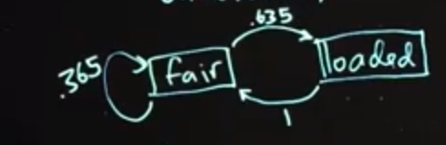

## Markov Chain Monte Carlo (MCMC)

### 1. Metropolis-Hastings : 

### 1.1 L'algorithme

C'est un algorithme qui nous permet d'échantilloner à partir d'une distribution de probabilité générique qu'on appelera **Distribution cible** même si on ne connait pas la constante de normalisation. 

Pour faire cela, nous construirons et échantillerons à partir d'une chaîne de Markov qui à pour distribution stationnaire la **distribution cible** qu'on cherche. Ce qui revient à choisir une valeur arbitraire et ensuite itérativement accepter ou rejeter les échantillons candidats tiré à partir d'une autre distribution, qui est simple à échantilloner.

Disons qu'on veut produire des échantillons à partir d'une distribution cible qu'on appelera 
$$
p(\theta) \approx g(\theta)
$$

Metropolis-Hastings
1. Select initial value $\theta_0$

2. for i=1,...,m, repeat:

     a) Draw candidate $\theta^* \sim q(\theta^*|\theta_{i-1})$

  b)  
$$
  \alpha = \frac{g(\theta^*) / q(\theta^*|\theta_{i-1})}{ g(\theta_{i-1}) / q(\theta_{i-1}|\theta^*)} = \frac{g(\theta^*)q(\theta_{i-1}|\theta^*)}{g(\theta_{i-1})q(\theta^*|\theta_{i-1})}
$$
  c)

  ​	$\alpha \ge 1$ accept $\theta^*$ and set $\theta_i  \leftarrow \theta^*$

  ​	$0 \lt \alpha \lt 1$ accept $\theta^*$ and set $\theta_i \leftarrow \theta^*$ with proba $\alpha$

  ​			    reject $\theta^*$ and set $\theta_i \leftarrow \theta_{i-1}$ with proba $1 - \alpha$ 

les étapes b et c servent de correction car la **proposal distribution q** n'est pas la distribution cible *p*. A chaque étape dans la chaîne, on tire un candidat et décide si on déplace la chaîne ou si on reste où on est actuellement. Si le déplacement proposé est avantageux i.e. que $\alpha \ge 1$ on se déplacera sinon ce sera en fonction de la probabilité $\alpha $

Puisque notre décision dépends de l'état courant de la chaîne, nous avons bien une chaîne de markov. Un choix prudent qu'on doit prendre est avec la **candidate generating distribution q**

Il peut ou pas dépendre des précédentes itérations de la valeurs de $\theta$ . Un exemple ou il ne dépend pas de la précédente valeurs sera si $q(\theta^*)$ serait toujours la même distribution, si on prend cette option il devrait toujours être similaire à $p(\theta)$

Une autre option populaire, une qui ne dépend que de l'itération précédente est appelé **random walk Metropolis-Hastings** ou la **proposal distribution** est centré sur l'itération précédente. Par exemple, ce pourrait être une loi normal ou la moyenne est notre itération précédente $\theta_{i-1}$ . Vu que la loi normale est symétrique autour de sa moyenne, cet exemple vient avec un autre avantages
$$
\alpha = \frac{g(\theta^*) / q(\theta^*|\theta_{i-1})}{ g(\theta_{i-1}) / q(\theta_{i-1}|\theta^*)} = \frac{g(\theta^*)q(\theta_{i-1}|\theta^*)}{g(\theta_{i-1})q(\theta^*|\theta_{i-1})}
$$
Dans l'expression de alpha les deux $q()$ à droite vont s'annuler. Donc dans la marche aléatoire de Metropolis-Hastings; ou les candidats sont tirés à partir d'une loi normal et ou la moyenne est la valeur de l'itération précédent et ou nous avons une variance constante dans notre distribution normale; le **acceptance ratio $\alpha$** sera 
$$
\alpha = \frac{g(\theta^*) }{ g(\theta_{i-1}) } 
$$

Clairement, pas tous les candidats tirés sont acceptés. Donc, notre chaîne de Markov peut quelque fois rester ou elle est, possiblemenent pendant plusieurs itérations.

Le nombre de candidats qu'on va accepter dépend du type d'algorithme qu'on va utiliser. Si on approxime p avec q  et on tire toujours des candidats de cette distribution; accepter des candidats souvent est une bonne chose; ca signifie que q approxime bien p.

Cependant; on peut vouloir que q a une plus grande variance que p; et voir quelques rejets de candidats, comme une assurance, que q couvre bien tous l'espace.

Comme on le verra, un taux d'acceptation élevé pour RWMH n'est pas une bonne chose. Si la marche aléatoire prend trop de petit pas, il acceptera souvent des candidats; mais il prendra énormément de temps à explorer la distribution posterior.

Au contraire; si elle prends beaucoup de grands pas; beaucoup de ces **proposals** auront une faible probabilité et le taux d'acceptation sera bas. Ce qui fera perdre beaucoup de tirage.

Idéalement; un random walk sampler devrait accepter entre 23 et 50% des candidats.

----------------------

What is the advantage of using a symmetric proposal distribution $q(\theta^* \mid \theta_{i-1})$ in a random walk Metropolis-Hastings sampler?

* Symmetry in a random walk yields $g(\theta^*) = g(\theta_{i-1})$, causing both expressions to drop out of the acceptance calculation which then becomes $q(\theta_{i-1} \mid \theta^*)\, /\, q(\theta^* \mid \theta_{i-1})$.

* Symmetry in a random walk causes the acceptance ratio to be greater than 1. Hence, the candidate is always accepted and we avoid an extra calculation.

* Symmetry in a random walk yields $q(\theta^* \mid \theta_{i-1}) = q(\theta_{i-1} \mid \theta^*)$, causing both expressions to drop out of the acceptance calculation which then becomes $g(\theta^*)\, /\, g(\theta_{i-1})$.

* Symmetry in a random walk provides a default choice that will not need to be tweaked for performance.

---------------------------------------

### 1.2 La démonstration

On va donner une démonstration de MCMC, pour estimer les probabilités à Posteriori dans un cas simple, un cas où on peut obtenir une forme analytique de la distribution à Posteriori.

On reprends l'exemple du frère qui a une pièce truqué qui renvoit face 70% du temps. Il vient vers nous on n'est pas sur si la pièce est truqué et il veut faire un pari avec nous.

On a une probabilité à Priori de 60%, que la pièce est truqué. Il nous laisse lancer la pièce 5x et on obtient : 2 faces et 3 piles. On doit trouver quel est la probabilité à Posteriori que la pièce est truqué
$$
\theta = \{ fair, loaded \} \\
Prior:~~P(\theta=loaded)=0.6
$$

$$
\begin{align}
f(\theta |X=2) &= \frac{f(X=2|\theta)f(\theta)}{\sum_{\theta}f(x|\theta)f(\theta)} \\

&= \frac{\binom{5}{x}[(\frac{1}{2})^5(0.4)\mathbb{I}_{ \{ \theta=fair \} }+(0.7)^x(0.3)^{5-x}(0.6) \mathbb{I}_{ \{ \theta=loaded \} }]}{\binom{5}{x}[(\frac{1}{2})^5(0.4)+(0.7)^x(0.3)^{5-x}(0.6) ]}\\

&= \frac{0.0125 \mathbb{I}_{ \{ \theta=fair \}} + 0.00794  \mathbb{I}_{ \{ \theta=truqué \}}   }{ 0.0125 +0.00794} \\

f(\theta | X=2) &= 0.612 \mathbb{I}_{ \{ \theta=fair \} } + 0.388 \mathbb{I}_{\{ \theta=loaded \} }
\end{align}
$$

**<u>Avec l'algorithme de Metropolis:</u>**

1) On commence soit avec $\theta_0=truqué $ ou $\theta_0=non ~~truqué $

2) For $i =1,...,m$

​	**a)** Propose candidate $\theta^* $to be the other state as $\theta_{i-1}$

​	**b)**   Notre fonction $q$ sera égale à 1 ici car elle est déterministe, à chaque fois on propose d'être l'autre état (truqué / non truqué), avec une probabilité de 1
$$
\alpha = \frac{g(\theta^*) / q(\theta^*|\theta_{i-1})}{ g(\theta_{i-1}) / q(\theta_{i-1}|\theta^*)} = \frac{f(X=2|\theta^*)f(\theta^*)/1}{f(X=2|\theta_{i-1})f(\theta_{i-1})/1}
$$
​	Si $\theta^* = loaded $ alors $\alpha = \frac{0.0794}{0.0125}=0.635$  attention on prends les valeurs non-normalisés

​	Si $\theta^* =  fair$ alors $\alpha = \frac{0.0125}{0.00794}=1.574$ 

​	**c) **

​	Si $\theta^* =   fair $  $\alpha > 1$ accept $\theta^* $  set $\theta_i = fair$

​	Si $\theta^* = loaded $ alors $\alpha=0.635 $ accept $\theta^*$ on l'accepte avec probabilité $0.635$ et mettre $\theta_i = loaded$ sinon, mettre $\theta_i = \theta_{i-1}=fair$

Si on veut calculer notre probabilité à Posterior $f(\theta=truqué | X=2)$ , on devrait simuler la chaîne de markov puis on compte le nombre de fois où il reste dans l'état "truqué" ce qui donnerait une bonne approximation que la pièce est truqué.

On peut aussi montrer théoriquement l'état stationnaire avec:
$$
\pi P = \pi \\

P =\begin{bmatrix} 0.365 & 0.635 \\ 1 & 0 \end{bmatrix} ~~~~ \pi=\begin{bmatrix} 0.612 & 0.388  \end{bmatrix} \\
$$
On peut calculer
$$
\begin{bmatrix} 0.612 & 0.388  \end{bmatrix} \cdot \begin{bmatrix} 0.365 & 0.635 \\ 1 & 0 \end{bmatrix} = \begin{bmatrix} 0.612 & 0.388  \end{bmatrix}
$$
Dans ce cas particulier on voit bien qu'on obtient une distribution stationnaire en utilisant l'algorithme de Metropolis

-------------------

In this demonstration, we set up a Markov chain with transition probability matrix $\begin{bmatrix} 0.365 & 0.635 \\ 1 & 0 \end{bmatrix}​$ and stationary distribution $\begin{bmatrix} 0.612 & 0.388  \end{bmatrix}​$  where the first state represents $\theta=\text{fair}​$  and the second state represents $\theta = \text{loaded}​$ If we were to simulate this Markov chain for many iterations, approximately what fraction of the time would the chain be in $\theta = \text{fair}​$ ?

* 0.388
* 0.612
* 0.365
* 0.635

---------------

