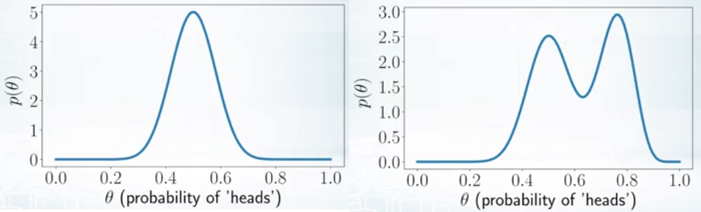
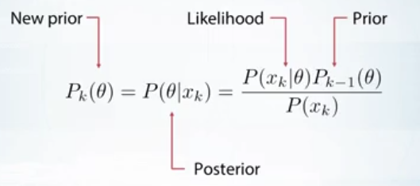
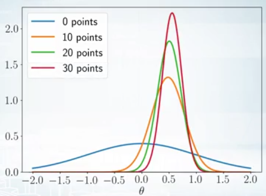
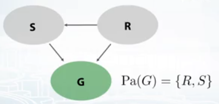
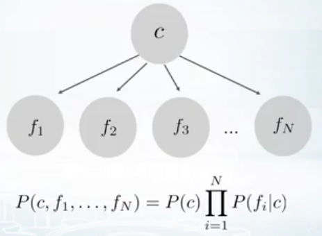
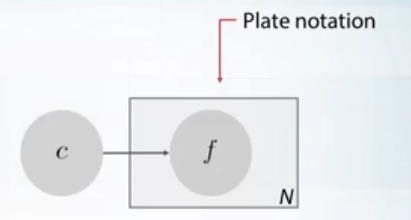
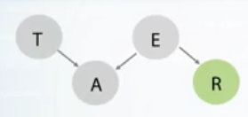
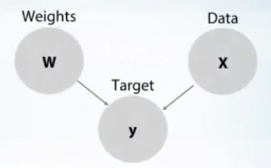

## Bayesian methods for machine learning

### 1. Chap1

#### 1.1

Les deux approches:

* Fréquentiste : $\theta$ est fixe; $X$ est aléatoire; la taille de l'échantillon doit être grande
* Bayésien : $\theta$ est aléatoire; $X$ est fixe; la taille de l'échantillon n'est pas important

On peut voir dans l'approche bayésienne le **Prior $P( \theta)$** comme un **regularizer**:
$$
P(\theta|X) = \frac{P(X|\theta)P(\theta)}{P(X)}
$$
Si on connait des informations sur un jeux de pile ou face; on va pouvoir changer le prior; on a mis deux exemples; ou normal à gauche et le cas de droite ou les probabilités de face sont surtout de 0.5 et 0.8

Les méthodes Bayésienne sont très bonne pour **le online learning**, on peut modéliser avec

On va l'illustrer sur un problème, ou on veut estimer un paramètre $\theta $,en rajoutant les points la variance se réduit et la moyenne se précise 

#### 1.2 Comment définir un modèle ?

La façon la plus simple est d'utiliser un **réseau bayésien**.

On peut écrire son modèle comme la lois de probabilité jointe sur toutes les variables:
$$
P(X_1,...,X_n) = \prod_{k=1}^{n} P(X_k | Pa(X_k))
$$
Avec $Pa$ est parents

On peut écrire la probabilité jointe sur notre exemple:
$$
P(S,R,G)=P(G|S,R)P(S|R)P(R)
$$
On peut mettre des exemples plus compliqués comme le classifieur Bayésien Naïf

On préfère l'écriture **plate** qui permet de gérer les répétitions, on doit répéter ce sous-graphe N fois

#### 1.3 Exemple: le voleur et l'alarme

T: Thief

E: Earthquake

On donne la probabilité qu'il y'a un voleur de $10^{-3}$i.e. 1 parmi 1000 maisons a été cambriolé. Pour les tremblements de terre, on dit qu'il y'a un tous les 200 jours

| Priors   |           |
| -------- | --------- |
| $P(T=1)$ | $10^{-3}$ |
| $P(E=1)$ | $10^{-2}$ |

On a deux probabilités de 1, si on a ou pas un tremblement de terre, mais toujours avec un voleur. On aura une probabilité de 1/10 dans le cas ou il y'a juste un tremblement de terre

| $P(A=1|T,E)$ | $E=0$ | $E=1$ |
| ------------ | ----- | ----- |
| $T=0$        | 0     | 1/10  |
| $T=1$        | 1     | 1     |

Le dernier tableau, on aura une probabilité de 1/2 pour les tremblements de terre ici; car il n'enverra pas de rapport si c'est un petit tremblement de terre

| $P(R|E)$ |      |
| -------- | ---- |
| $E=0$    | 0    |
| $E=1$    | 1/2  |

Index(3)

On va pouvoir calculer la Probabilité à Posteriori :
$$
\begin{align}
P(T | A) &= \frac{P(T, A)}{P(A)} \\
&= \frac{P(T,A,E) + P(T, A, \bar{E})}{P(T,A,E) + P(T, A, \bar{E}) + P(\bar{T},A,E) + P(\bar{T}, A, \bar{E})} \\
& \approx 50 \%
\end{align}
$$
On calcule ausi :
$$
\begin{align}
P(T | A, R) &= \frac{P(T, A, R)}{P(A, R)} \\
& \approx 1 %
\end{align}
$$
Nous avons en fait mal défini le graphe il faudrait rajouter une liaison entre E et T

#### 1.4 Exemple: Régression linéaire

$$
L(\omega) = \sum_{i=1}^{N} (\omega^Tx_i - y_i)^2 = \| \omega^T X - y \|^2 \rightarrow \underset{\omega}{min}\\
\hat{\omega} = arg\underset{\omega}{min}L(\omega)
$$

Voyons avec le **cas Bayésien**, nous avons trois noeuds,

 nous ne sommes pas interessés à modéliser les données on va donc pouvoir écrire :
$$
p(\omega, y | X) = p(y | X, \omega) p(\omega)
$$
On va devoir ensuite définir les distributions :
$$
p(y | \omega, X) = \mathcal{N}(y | \omega^T X, \sigma^2 I) \\
p(\omega) = \mathcal{N}(\omega |0, \gamma^2I)
$$
On va calculer **la distribution à à Posteriori**
$$
p(\omega | y, X) = \frac{p(y, \omega | X)}{p(y | X)} \rightarrow \underset{\omega}{max}
$$
On ne va pas considérer le dénominateur car on veut maximiser $\omega$ et il n'apparait pas au dénominateur. On va de plus rajouter le logarithme des deux côtés pour avoir une fonction concave :
$$
log\Big(p(y, \omega | X)\Big) = log\Big(p(y | X, \omega) p(\omega)\Big) \rightarrow \underset{\omega}{max}
$$

$$
log\Big( p(y | X, \omega)\Big) + log\Big(p(\omega)\Big) \\
\begin{align}
&= log c_1 \cdot exp\Big( - \frac{1}{2}(y - \omega^Tx)^T[\sigma^2]^{-1}(y - \omega^T x )\Big) + log c_2 \cdot exp\Big(- \frac{1}{2} \omega^T [\gamma^2 I]^{-1} \omega^T \Big) \\
&= - \frac{1}{2 \sigma^2} (y - \omega^Tx)^T(y - \omega^Tx) - \frac{1}{2 \gamma^2} \omega^T \omega \\
&= - \frac{1}{2 \sigma^2} \| y - \omega^Tx \|^2 - \frac{1}{2 \gamma^2}   \| \omega \|^2 \rightarrow \underset{\omega}{max} -1 \cdot 2 \sigma^2\\
\end{align}
$$

 

On voit que en prenant en Distribution à priori une loi normale, on se retrouve en sortie avec une régression linéaire, avec un régulariseur $L^2$
$$
\| y - \omega^Tx \|^2 + \lambda \| \omega \|^2 \rightarrow \underset{\omega}{min} 
$$

