## Expectation-Maximization Algorithm

Les questions qu'on va répondre:

* Qu'est ce qu'une variable **Latente**, pourquoi en a ton besoin, et comment les utiliser ?
* Les modèles communs de **variables latentes** (clustering et réduction de dimensions)
* Comment les entrainer avec l'algorithme **Expectation Maximisation**
* Les extensions de **E.M.** tel que avec la gestion des données manquantes

[TOC]

### 1. Les variables latentes

Les variables latentes (cachés) est une variable qu'on n'a jamais observé, ni dans le training ni dans le test. Ce sont des variables qu'on ne pas mesurer directement comme l'intelligence, l'altruisme etc..

**<u>Exemple:</u>** 

On a une entreprise d'informatique, on souhaite employer une personne, pour chaque candidat on a des données qui ne sont pas toutes complètes. Vu qu'il y'a beaucoup de candidats on ne souhaite pas qu'ils viennent tous faire l'entretien sur place, on va donc utilisé des données historiques où on avait déjà ce genre d'informations. 

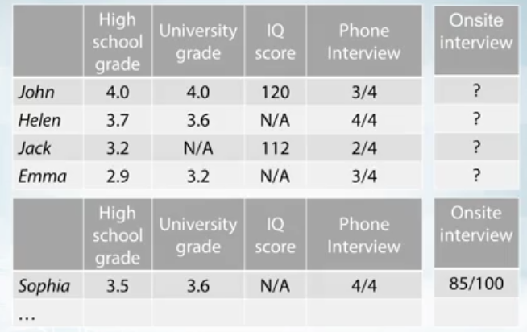

On se retrouve donc avec un problème de régression classique, cependant, il y'a deux problèmes qui font qu'on ne pourra pas appliquer cette méthode :

* On a des valeurs manquantes
* On veut mesurer l'incertitude de nos prédictions

*<u>Modélisation probabilistique des données:</u>*

Nos deux contraintes vont amener à un autre type de méthode, on veut savoir qu'elles variables sont corrélées entre elles, ici, elles semblent toutes corrélés. Dans cette situation, nous devons assigner des probabilités à toutes les combinaisons de nos features.

Une des possibilités est de poser:

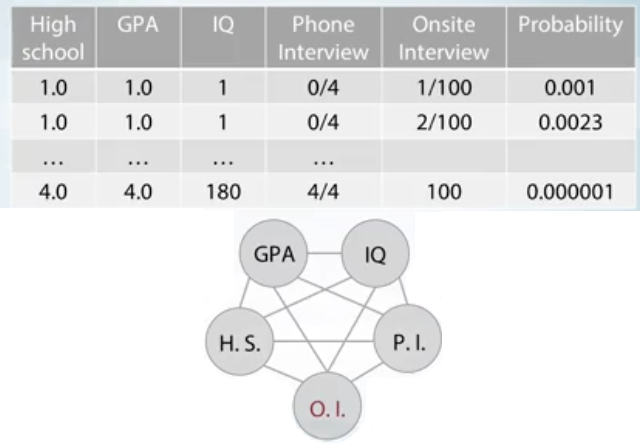
$$
p(x_1,x_2, x_3, x_4,x_5) = \frac{exp(-\omega^Tx)}{Z}
$$
Le problème est $Z$ qui est la **normalizing constant** qui est la somme par rapport à toutes les configurations possibles, ce qui est immense pour l'entrainement et la prédiction. On doit trouver une autre solution, **on peut rajouter une nouvelle variable** qu'on appelle *Intelligence*

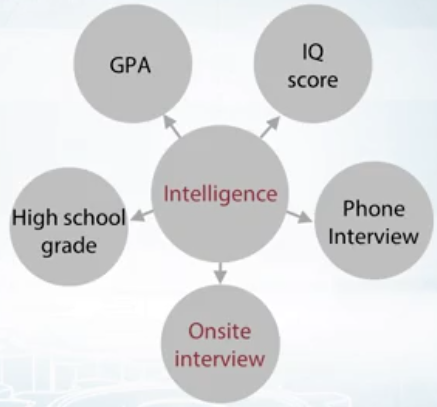

Si on accepte ce type de modèle, on réduit énormément la complexité:
$$
\begin{align}
p(x_1,x_2, x_3, x_4,x_5) &= \sum_{I=1}^{100}  p(x_1,x_2, x_3, x_4,x_5| I)  \\
&=\sum_{I=1}^{100} p(x_1|I) ... p(x_5|I)p(I)
\end{align}
$$
Les modèles des variables latentes - **Pros:**

* Modèle plus simple (moins d'arêtes)
* Moins de paramètres
* Les variables latentes sont parfois significative
  * La variable Intelligence n'a pas été codé en dure, elle n'a donc pas forcément la signification qu'on pourrait attendre; mais elle permet de comparer

**Cons:**

* Plus dure de travailler avec, beaucoup de mathématiques en plus.

### 2. Clustering probabilistique

On va défini deux types de clustering :

* Hard clustering :

  * On va assigner une valeurs à un point pour le ranger dans un groupe

* Soft clustering

  * On va assigner une probabilité d'appartenance à un groupe

On va pouvoir utiliser ce modèle pour deux opérations :

1. <u>**Hyperparamètre tuning**</u>, contrairement à un modèle Hard, on va avoir un moyen de connaitre le nombre de cluster plus ou moins optimaux.

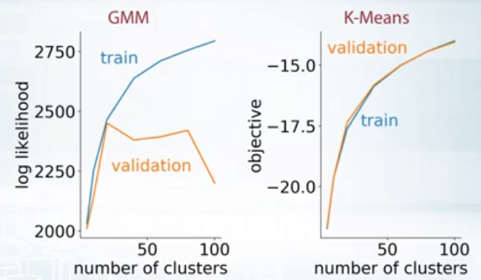

2. <u>**Générer des nouveaux points**</u> on va créer un **modèle génératif de nos données**, on pourra générer de nouvelles images à partir d'un ensemble d'entraînements

On va utiliser comme modèle le **Gaussian Mixture Model (GMM) ** chaque points vient d'une gaussienne, la densité de chaque point est une somme pondérés de chaque gaussienne : 

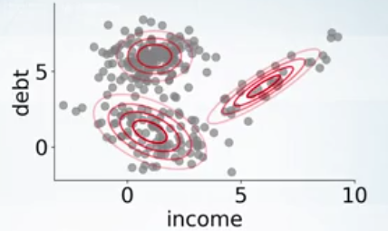
$$
p(x | \theta) = \pi_1 \mathcal{N}(x |\mu_1,\Sigma_1) + \pi_2 \mathcal{N}(x |\mu_2,\Sigma_2) + \pi_3 \mathcal{N}(x |\mu_3,\Sigma_3) \\
\theta = \{ \pi_1, \pi_2, \pi_3, \mu_1, \mu_2, \mu_3 , \Sigma_1, \Sigma_2, \Sigma_3\}
$$
*Bilan du modèle :*

* Pro : Flexible
* Cons : le nombre de paramètres, pour trois clusters on a déjà 9 paramètres

Pour trouver les paramètres optimaux, on va le faire avec **MLE**
$$
\underset{\theta}{max} \prod_{i=1}^{N}p(x_i | \theta) = \prod_{i=1}^{N}\Big(\pi_1 \mathcal{N}(x_i|\mu_1, \Sigma_1)+... \Big) \\
subject~~to~~ \pi_1 + \pi_2 + \pi_3 = 1;\pi_k \ge0; k=1,2,3 \\
\Sigma_k \gt 0
$$
On peut utiliser des algorithmes d'optimisations comme ADAM (descente de gradient stochastique) ou autres. La contrainte que la matrice de covariance doit être défini positive, est très forte et va poser problème pour obtenir de bon résultats, on peut sinon forcer à que la matrice soit diagonale ce qui donne des résultats correcte.

On va comparer les résultats et voir que **EM donne les meilleurs résultats**, il est déficile de bien entrainer avec SGD

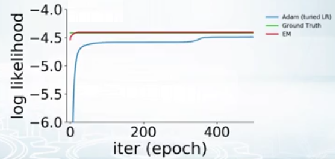

**Introduire les variables latentes:**

On va introduire une variable $t$ qui va indiquer de quels gaussienne ce point vient.
$$
p(x | \theta) = \pi_1 \mathcal{N}(x |\mu_1,\Sigma_1) + \pi_2 \mathcal{N}(x |\mu_2,\Sigma_2) + \pi_3 \mathcal{N}(x |\mu_3,\Sigma_3)
$$
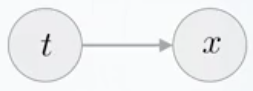
$$
p(t=c | \theta) = \pi_c \\
p(x | t=c, \theta) = \mathcal{N}(x | \mu_c, \Sigma_c) \\
p(x | \theta) = \sum_{c=1}^{3} p(x |t=c, \theta)p(t=c | \theta)
$$
On peut remarquer que si on remplace les paramètres de la vraisemblance et de la distribution à Priori, on retombe sur la même formule qu'en haut.

**Exemple de l'algorithme Expectation Maximization :**

Comment estimer le paramètre $\theta$ ? 

* Si **on connait le cluster de chaque points**, on peut utiliser directement les estimateurs classiques de chaque groupe dans le cas d'un *hard cluster*

Dans le cas d'un *soft cluster* , on aura des poids de probabilités à rajouter, on donne ci-dessous le cas ou on calcule les estimateurs du groupe bleu
$$
\mu_1 = \frac{\sum_i p(t_i=1 | x_i, \theta)x_i}{\sum_i p(t_i=1 | x_i, \theta)} ~~~~~~~~~~ \sigma^2 = \frac{\sum_i p(t_i=1 | x_i, \theta)(x_i-\mu_1)^2}{\sum_i p(t_i=1 | x_i, \theta)}
$$

* Si **on ne connait pas les clusters** ce qui est le cas le plus général

**<u>L'algorithme EM</u>**

1. Commencer par deux paramètres gaussiens $\theta$ aléatoires

2. Répéter jusqu'à convergence :

   a. Pour chaque point calculer $p(t=c | x_i; \theta)$ : est-ce que $x_i$ semble venir du cluster $c$ ?

   b. Mettre à jours les paramètres $\theta$ du Gaussien

**Exemple : **

Dans itération 1, le point qui est le plus à gauche à une densité très faible, mais on va l'assigner au groupe des bleus, car en faisant un simple calcul on obtient une probabilité de un.

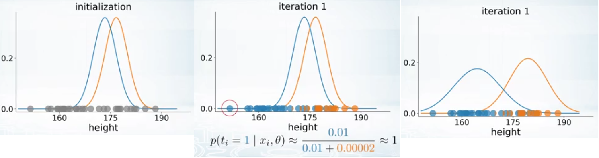

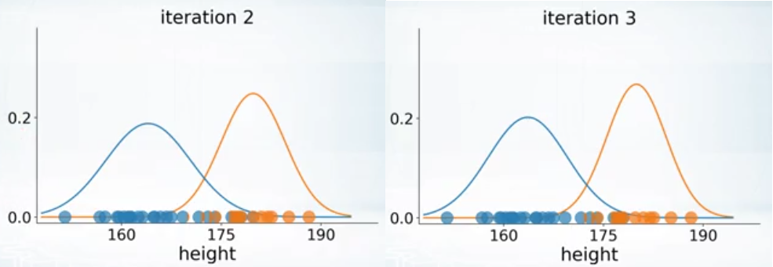

**Exemple où on reste bloqué sur un maximum locale : **

On voit aussi que le rôle de initialisation a un fort impact sur les formes des gaussiennes

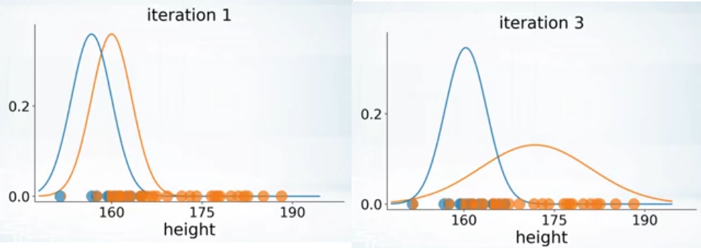

**Bilan : **

* Le modèle de mixture Gaussien est une approche probabilistique flexible pour les problèmes de clustering
* l'algorithme EM peut entrainer GMM plus rapidement que par descente de gradient stochastique et peut aussi gérer des contraintes compliqués comme celle de la matrice de covariance qui est défini positive
* EM souffre de maximum locaux $\Big($la solution exact est $\mathcal{NP}$-hard $\Big)$

### 3. Généralisation du modèle EM

#### 3.1 Les outils

* Kullback-Leibler divergence : c'est une façon de mesurer la différence entre deux distributions probabilistiques. 
  * Une approche très simple est juste de calculé la distance des paramètres, cependant, on obtient 1 pour les deux ce qui ne semble pas très réaliste
  * On va utiliser une autre mesurer le KL-divergence

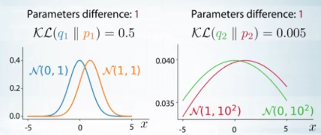

*La formule du Kullback-Leibler divergence* :
$$
\mathcal{KL}(q \|p) = \int q(x) log \frac{q(x)}{p(x)}dx
$$
On veut savoir à quelle point les deux distributions sont sur une échelle logarithme et on prends l'espérance de cette valeur. On moyenne sur tous l'espace des nombres réels.

**Propriétés :**

1. $\mathcal{KL}(q \| p) \neq  \mathcal{KL}(p \| q)$ c'est asymétrique, et ça n'est pas une vrais distance
2. $\mathcal{KL}(q \| q) = 0 $  
3. $\mathcal{KL}(q \| p) \ge 0 $  

*preuve :*
$$
\begin{align}
- \mathcal{KL}(q \| p) &= \mathbb{E}_q(-log\frac{q}{p}) = \mathbb{E}(log \frac{p}{q}) \\
&\le log(\mathbb{E}_q \frac{p}{q}) = log \int q(x) \frac{p(x)}{q(x)}dx=0
\end{align}
$$

#### 3.2 Forme générale

##### 3.2.1 Modélisation avec une distribution

On rappelle le modèle qu'on avait déjà défini, avec une légére variation, nous avons du $x_i $

$$
p(x_i | \theta) = \sum_{c=1}^{3} p(x_i |t=c, \theta)p(t_i = c | \theta)
$$
On va ensuite calculer le maximum de vraisemblance et le borner avec l'inégalité de Jensen
$$
\begin{align}
\underset{\theta}{max}~log~p(X | \theta) &= log \prod_{i=1}^{N} p(x_i | \theta) \\
&= \sum_{i=1}^{N} log~p(x_i | \theta) \\
&= \sum_{i=1}^{N} log \sum_{c=1}^{3} p(x_i,t_i=c | \theta) \ge \mathcal{L}(\theta)
\end{align}
$$
On va ensuite imaginer qu'il n'y a que un seul paramètre à optimiser $\theta $ , sauf que comme on l'avait dit c'est un problème $\mathcal{NP}-hard​$ il n'y a donc pas de solution simple, on sera donc content d'avoir déjà un maximum locale. Comme première solution on peut imaginer de prendre une lower bound, cependant ici, elle risque d'amener à un minimum locale ce qui n'est pas ce qu'on souhaite.

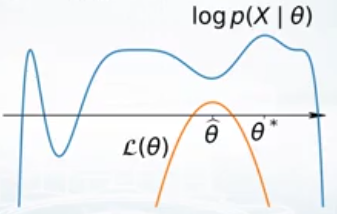

##### 3.2.2 Modélisation avec plusieurs distributions

On peut créer une famille de lower bound à la place
$$
\begin{align}
\underset{\theta}{max}~log~p(X | \theta) 
&= \sum_{i=1}^{N} log~p(x_i | \theta) \\
&= \sum_{i=1}^{N} log \sum_{c=1}^{3}\frac{q(t_i=c)}{q(t_i=c)}  p(x_i,t_i=c | \theta) \\
& \ge \sum_{i=1}^{N} \sum_{c=1}^{3}q(t_i=c) log \frac{p(x_i, t_i=c | \theta)}{q(t_i=c)} \\
&= \mathcal{L}(\theta,q)
\end{align}
$$
*Inégalité de Jensen :*
$$
log \Big( \sum_c \alpha_c v_c \Big) \ge \sum_c \alpha_c log(v_c)
$$
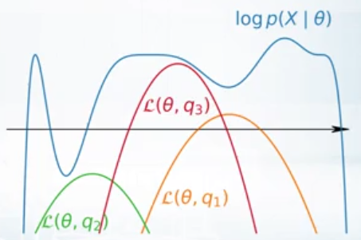

Ce paramètres $\mathcal{L}(\theta,q)$ s'appelle le **Variational lower bound** car il dépend de $q$ qui varie, qu'on appelle le **variational parameter**

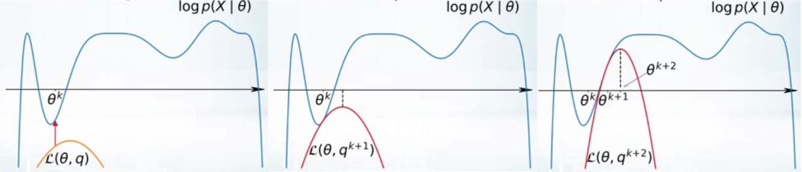

On peut découper en deux les deux :

* **E-step **

$$
q^{k+1} = \underset{q}{arg~max}~ \mathcal{L} (\theta^k, q)
$$

* **M-step**

$$
\theta^{k+1} = \underset{\theta}{arg~max}~ \mathcal{L}(\theta, q^{k+1})
$$

##### 3.2.3 Détails sur la E-step

Ce qu'on veut calculer durant la E-step, c'est la différence (gap) entre notre vraisemblance et notre second graphe pour l'optimisation, on va pouvoir noter:
$$
GAP = log~p(X | \theta) - \mathcal{L}(\theta, q)
$$
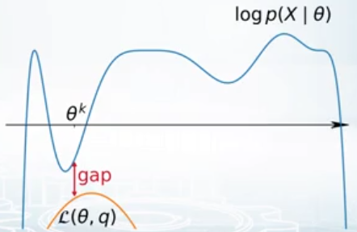

On peut développer l'expression : (ligne 2 on va rajouter une expression qui se somme et donne un)
$$
\begin{align}
GAP &= \sum_{i=1}^{N} log~p(x_i | \theta) -   \sum_{i=1}^{N} \sum_{c=1}^{3}q(t_i=c) log \frac{p(x_i, t_i=c | \theta)}{q(t_i=c)} \\
&= \sum_{i=1}^{N} \Big( log~p(x_i | \theta) \cdot \underbrace{\sum_{c=1}^{3} q(t_i=c)}_{1}   - \sum_{c=1}^{3} q(t_i=c) \cdot log... \Big) \\
& =  \sum_{i=1}^{N} \sum_{c=1}^{3}q(t_i=c) \Big( log~p(x_i | \theta) - log \frac{p(x_i, t_i=c | \theta)}{q(t_i=c)} \Big) \\
& = \sum_{i=1}^{N} \sum_{c=1}^{3} q(t_i=c) log \frac{p(x_i |\theta)q(t_i=c)}{\underbrace{p(x_i,t_i= c | \theta)}_{p(t_i=c|x,\theta)p(x_i |\theta),par~bayes~rule}} \\
&= \sum_{i=1}^{N} \underbrace{ \sum_{c=1}^{3} q(t_i=c) log \frac{q(t_i=c)}{p(t_i=c | x_i, \theta)}}_{ \mathcal{KL}\Big(q(t_i \| p(t_i=c | x_i, \theta))\Big)}
\end{align}
$$
Enfin on va pouvoir reprendre l'expression initiale du Gap et utiliser les propriétés de la divergence de KL :
$$
\begin{align}

GAP &= log~p(X | \theta) \underbrace{- \underbrace{\mathcal{L}(\theta, q)}_{\underset{q}{max}}}_{ min} \\

&=\underbrace{ \mathcal{KL}\Big(q(t_i \| p(t_i | x_i, \theta))\Big)}_{ \underset{q}{min}} \ge 0
\end{align}
$$
Pour trouver l'optimum globale on voudra que la distance entre les deux distributions soit nulles on va pouvoir poser que :
$$
q(t_i ) = p(t_i | x_i, \theta)
$$
Et dire que la distribution à Posteriori devra être égale à la distribution latente

##### 3.2.4 Détails sur la M-step

$$
\begin{align}
\mathcal{L}(\theta, q) &=  \sum_{i} \sum_{c} q(t_i=c) log \frac{p(x_i, t_i=c | \theta)}{q(t_i=c)}\\
& = \sum_{i} \sum_{c} q(t_i=c) log(x_i, t_i=c | \theta) - \sum_{i} \sum_{c} q(t_i=c)log~q(t_i=c)\\
&= \underbrace{\mathbb{E}_qlog~p(X, T | \theta)}_{(Usually)concave~fct~w.r.t ~\theta,~easy~to~optimize} + cst
\end{align}
$$

##### 3.2.5 L'algorithme Expectation Maximization

**<u>Algorithme :</u>**

Pour k = 1,...

**E-step:**
$$
q^{k+1} = \underset{q}{arg~min} \mathcal{KL}[q(T) \| p(T | X, \theta^k)] \\
\iff \\
q^{k+1}(t_i) = p(t_i | x_i, \theta^k)
$$
**M-step:**
$$
\theta^{k+1} = \underset{\theta}{arg~max}~ \mathbb{E}_{q^{k+1}}~log~p(X, T | \theta)
$$

##### 3.2.6 Garanties de convergence

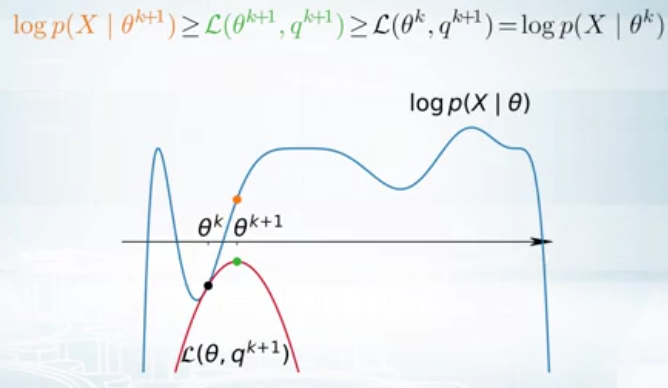

On a donc obtenu l'inégalité:
$$
log~p(X|\theta^{k+1}) \ge log~p(X | \theta^k)
$$
Ce qui revient à dire que :

* A chaque itération la log vraisemblance (fonction objectif ici) ne fait que augmenter, si ce n'est pas le cas il y'a un problème dans le code (bon pour le débugging)
* L'algorithme est garantie de converger vers un maximum locale (ou un saddle point)

##### 3.2.7 Exemple

30% de 1; 20% de 2 et 50% de 3 ou : $N_1=30, N_2=20, N_3=60$

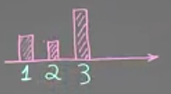

On veut ajuster une distribution sur ces données, on va dire qu'on sait que ces données viennent d'une mixture, qu'on peut définir :
$$
p(x_i | \gamma) = \gamma \cdot p_1(x_i) + (1 - \gamma) \cdot p_2(x_i)
$$
Les composants de la mixture sont défini comme

|            | 1         | 2             | 3        |
| ---------- | --------- | ------------- | -------- |
| **$p_1 $** | $\alpha $ | $1 - \alpha $ | 0        |
| **$p_2 $** | 0         | $1 - \beta $  | $\beta $ |

Pour commencer l'algorithme, on va devoir **initialiser** :
$$
\alpha_0 = \beta_0 = \gamma_0 = 0.5
$$
On va devoir aussi définir le modèle latent, en rajoutant $t_i \in \{1,2 \} $ pour chaque $x_i  $ qui lui dira de quelle distribution il vient :
$$
p(t_i = 1) = \gamma ~~~~~~~~ p(x_i | t_i = 2) = p_2(x_i)
$$

<u>Commençons par la **E-step**, on veut trouver : (avec la distribution à Posteriori)</u>
$$
\begin{align}
q(t_i = c) &= p(t_i = c | x_i) \\
p(t_i=1 | x_i =1) &= \frac{p(x_i=1 | t_i=1)p(t_i=1)}{p(x_i=1 | t_i=1)p(t_i=1) + p(x_i=1 | t_i=2)p(t_i=2)} \\
&= \frac{\alpha \cdot \gamma}{ \alpha \cdot \gamma + 0 \cdot (1-\gamma)} \\
&= 1 \\
p(t_i=1 | x_i=2) &= \frac{(1-\alpha)\gamma}{(1-\alpha)\cdot \gamma + (1- \beta)\cdot (1- \gamma)} \\
&= \frac{0.5 \cdot 0.5}{0.5 \cdot 0.5 + 0.5 \cdot 0.5} \\
&= 0.5 \\
p(t_i=1|x_i=3)&=0
\end{align}
$$
<u>Puis la **M-step** :</u>
$$
\begin{align}
&\underset{\alpha, \beta, \gamma}{max} \sum_{i=1}^{N} \mathbb{E}_{q(t_i)} log~p(x_i|t_i, \alpha, \beta, \gamma)\cdot p(t_i) \\
&=  \sum_{i=1}^{N} q(t_i=1) \cdot ~log~p(x_i|t_i=1)\cdot \underbrace{\gamma}_{prior} +
\sum_{i=1}^{N} q(t_i=2) \cdot ~log~p(x_i|t_i=2)\cdot \underbrace{1-\gamma}_{prior} \\
&= N_1 \cdot \underbrace{  p(t_i=1 |x_i=1)}_{=1,~~E-step} log~\alpha \cdot \gamma + N_2 \cdot 0.5 \cdot log~(1- \alpha)\gamma + N_3 \underbrace{\cdot 0 \cdot log(0)}_{=0} \\
& + N_1 \underbrace{ \cdot p(t_1=2 |x_i=1)}_{=~0} + N_2 \cdot 0.5 \cdot log(1- \beta)\cdot (1- \gamma) + 60 \cdot 1 \cdot log \beta \cdot (1-\gamma) \\
&= 30\cdot log\alpha + 10 \cdot log(1-\alpha ) + cst

\end{align}
$$
On a réduit l'expression uniquement a des termes comprenant $\alpha $ car on va maximiser par cette valeur en premier. On va de plus, chercher à maximiser la valeur, par calcul du gradient (on ne montre que le cas de $\alpha$ et on affichera les autres résultats)
$$
\begin{align}
  30 \cdot \frac{1}{\alpha} + 10 \cdot \frac{1\cdot(-1)}{1-\alpha}=0 \\
  \alpha = \frac{30}{40};\beta = \frac{6}{7}; \gamma = \frac{4}{11}\\
   \\
  
 \end{align}
$$
On n'aura plus besoin de mettre à jours les paramètres, on a déjà convergé après une itération de EM, ce qui fait plutôt sens car si on remplace les valeurs dans le tableau plus haut, on voit qu'on a bien deux groupes distincts qui sont crées avec un poids assez fort pour $\beta $ qui a le plus grand effectif

##### 3.2.8 Résumé de l'algorithme

* Méthode pour entrainer des modèles de variables latentes
* Gère les valeurs manquantes, on considère ces valeurs comme des valeurs latentes
* C'est une suite de tâche simples plutôt que une difficile
* EM est garantie de converger
* Il aide à résoudre des problèmes d'optimisations avec des contraintes compliqués comme celle avec $\sum_c \gt 0$ , la matrice doit être définie positive
* EM possède plusieurs extensions :
  * Variational E-step
  * Sampling on M-step
* Cons de EM: Renvoie uniquement que des maximum locaux (ou saddle point) et demande des maths

### 4. Applications de EM

#### 4.1 Modèle de Mélange Gaussien - GMM

Rappels :

**<u>E-step</u>**:

**EM:** pour chaque point on calcule :
$$
q(t_i) = p(t_i | x_i, \theta)
$$
**GMM:** pour chaque point on calcule :
$$
p(t_i |x_i, \theta)
$$
**<u>M-step</u>**:

**EM:** On met à jours les paramètres à maximiser
$$
\underset{\theta}{max}~ \mathbb{E}_q~log~p(X, T | \theta)
$$
**GMM:** on met à jours les paramètres gaussiens pour ajuster les points qui leurs sont assignés
$$
\mu_1 = \frac{\sum_i p(t_i=1 | x_i, \theta) \cdot x_i}{\sum_i p(t_i=1 | x_i, \theta)}
$$

-----------------------

**<u>Modélisation, M-step pour GMM</u>**
$$
\begin{align}
&\underset{\theta}{max} \sum_{i=1}^{N} \mathbb{E}_{q(t_i)} ~log~p(x_i,t_i |\theta) \\
& = \sum_{i=1}^{N}\sum_{c=1}^{3}q(t_i=c) \cdot log\Big( \frac{1}{z}\cdot exp( - \frac{(x_i - \mu_c)}{2 \cdot \sigma^2}) \cdot \pi_c \Big) \\
&= C\sum_{c=1}^{3} q(t_i=c) \cdot \Big( log \frac{\pi_c}{2} - \frac{(x_i - \mu_c)^2}{2 \cdot \sigma_i^2} \Big) \\
& \frac{\part ...}{\part \mu_1} = \sum_{i=1}^{N} q(t_i=1) \cdot \Big(0 - \frac{ 2 \cdot (x_i - \mu_1)(-1)}{2 \sigma^2_1}  \Big)\cdot \sigma^2_1 = 0 \cdot \underbrace{\sigma^2_1}_{on~rajoute~\sigma_1^2 } \\
&= \sum_{i=1}^{N} q(t_1=1) (x_i) - \Big(\sum_{i=1}^{N}q(t_i=1) \Big) \cdot \mu_1 =0 \\
\end{align}
$$
On peut en déduire les deux formules suivantes :
$$
\mu_1 = \frac{\sum_i q(t_i=1) \cdot x_i}{\sum_i q(t_i=1)} ~~~~~ \sigma_c^2 = \frac{\sum_i (x_i - \mu_c)^2 \cdot q(t_i=c)}{\sum_i q(t_i=c)}
$$
Les résultats qu'on obtient sont bien les mêmes qu'on avait obtenu avec le raisonnement précédent. 

On peut aussi donner la formule pour la distribution à Priori :
$$
\pi_c \ge 0 \\
\pi_1 + \pi_2 + \pi_3 = 1 \\
\pi_c = \frac{\sum_{i=1}^{N}q(t_i=c)}{N}
$$
On a pu voir que GMM est juste un cas particulier de EM 

#### 4.2 K-means

On va vouloir montrer que K-means est en fait un cas particulier de l'algorithme E.M.

**<u>Rappel de l'algorithme des K-means :</u>**

1. Initialiser aléatoirement les paramètres $\theta = \{ \mu_1,..., \mu_C \}$

2. Jusqu'à convergence répéter :

   a ) Pour chaque point calculer le centroïde le plus proche

   $c_i = \underset{c}{arg~min} \| x_i - \mu_c \|^2$

   b) Mettre à jours les centroïdes

   $$
   \mu_c = \frac{\sum_{i:c_i=c}x_i}{ \# \{ i : c_i=c \} }
   $$

**<u>Pour passer de GMM à K-means:</u>**

* On doit fixer les covariances à être identiques $\Sigma_c = I$, ce sont donc des cercles de même tailles
* On fixe les poids pour qu'ils soient uniformes $\pi_c = \frac{1}{ \# ~of~Gaussians}$ on divise par le nombre de cluster

On réécrit l'expression de la densité, on peut prouver que c'est la formule de la loi normale généralisé, uniquement si on a des matrices de covariances identiques :
$$
p(x_i | t_i=c, \theta) = \frac{1}{Z} exp(-0.5 \| x_i - \mu_c \|^2)
$$
**<u>K-means de la perspective de EM:</u>** - E-step

La formulation pour la **E-step** est de base pour du soft clustering il donne la probabilité qu'on appartienne à chaque cluster, mais on va lui rajouter une variable supplémentaires dans le arg min, afin, de le transformer en hard clustering (ce que fait K-means):
$$
q^{k+1} = \underset{q \in Q}{arg~min}~ \mathcal{KL} \Big[ q(T) \| p(T | X, \theta^k) \Big]
$$
On va choisir le $q$ parmi un ensemble de delta fonction, ou distribution de Dirac. Dans l'exemple ci-dessous on aura deux clusters avec une probabilité respective de 40% et de 60%, il mettra toutes la masse de probabilité dans celle qui a la plus forte probabilité, 2 dans notre cas.

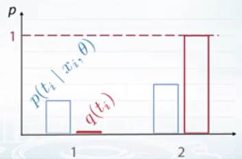

Ce qu'on peut écrire mathématiquement :
$$
q^{k+1}(t_i) = \left\{
    \begin{array}{ll}
        1 & \mbox{si } t_i = c_i \\
        0 & \mbox{sinon}
    \end{array}
\right.
$$
De plus,
$$
c_i = \underset{c}{arg~max} ~p(t_i=c | x_i, \theta)
$$
La distribution à Posteriori est proportionnelle à la distribution jointe :
$$
\begin{align}
p(t_i| x_i, \theta ) &= \frac{1}{Z} \cdot p(x_i |t_i, \theta) \cdot p(t_i |\theta) \\
&= \frac{1}{Z} ~exp(-0.5 \| x_i - \mu_c \|)^2 \cdot \pi_c
\end{align}
$$
On veut maximiser cette expression par rapport à $t_i $ , on peut enlever la constante de normalisation ainsi que la valeur à priori car elles ne sont pas connectés avec cette variable. Pour la partie exponentielle maximiser quelque chose de négatif revient à le minimiser, on va pouvoir réécrire l'expression du $c_i $ :
$$
c_i = \underset{c}{arg~min} \| x_i - \mu_c \|^2
$$
Nous avons trouvé exactement la même expression qu'avec K-means, on va chercher le cluster le plus proche et le point en question sera automatiquement classifié dans cette catégorie.

**<u>K-means de la perspective de EM:</u>** - M-step (Restricted GMM)

On rappelle le résultat qu'on avait obtenue avec GMM et la E-step ci-dessus :
$$
\underset{\mu}{max} \sum_{i=1}^{N} \mathbb{E_{q(t_i)}}\cdot log~p(x_i, t_i | \mu)
$$
On va égaliser le résultat de GMM avec la moyenne du K-means
$$
\mu_c = \frac{\sum_i q(t_i=c) \cdot x_i}{\sum_i q(t_i=c)} = \frac{\sum_{i:C_i^*=c} x_i}{ \# \{ i : C_i^*=c \} }
$$
et
$$
q(t_i) = \left\{
    \begin{array}{ll}
        1 & \mbox{si } t_i = c_i^* \\
        0 & \mbox{sinon}
    \end{array}
\right.
$$
-------------> y'a des trucs bizarres dans les slides et ce qu'il écrit c'est pas pareil

**<u>Résumé de la liaison entre K-means et EM</u>**

K-means est en fait un cas particulier de EM pour un modèle de mélange Gaussien (GMM), mais

* Avec une matrice de covariance fixe : $\Sigma_c = I $
* On a simplifié la E-step (appromixation de $p(t_i | x_i, \theta) $ avec des fonctions de dirac)
* Ce qui rend K-means plus rapide mais moins flexible que GMM
* On va pouvoir gérer les valeurs manquantes grâce aux propriétés de EM

#### 4.3 Formulation probabilistique de ACP

On va imaginer une situation où le prix des glaces augmentent en fonction de la température, plus il fait chaud, plus le prix augmente. On voit graphiquement qu'ils sont fortement corrélés

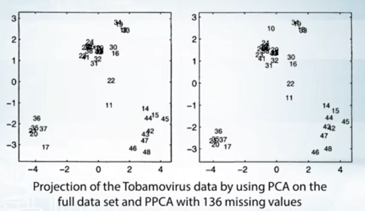

**<u>Probabilistic PCA :</u>**

On va appeler la projection une dimension, variables latentes, car c'est quelque chose qu'on n'observe pas directement, il faut aussi définir une distribution à Priori qui sera :
$$
p(t_i) = \mathcal{N}(0, I)
$$
Ce qui signifiera que notre projection sera autour de 0 et aura une variance autour de 1.

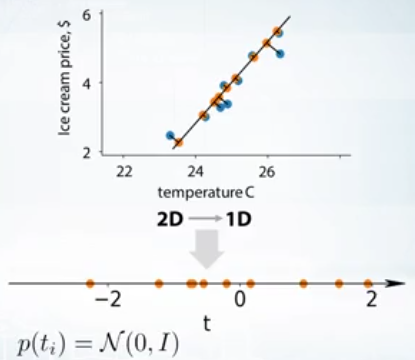

On doit maintenant définir la vraisemblance qui permettra de connecter la première et seconde dimensions directement, dans notre problème :
$$
x_i = (1,1)\cdot t_i + (25, 4)
$$
Ou plus généralement :
$$
x_i = W \cdot t_i + b
$$
**On peut colorier les $x_i $ en orange car ce sont les projections sur la dimension 1**

La question est de comment réussir à définir les points  bleus, on va par simpliciter dire qu'ils sont équivalents aux points oranges avec une petite erreur :
$$
x_i = W \cdot t_i + b + \epsilon_i, ~~~~~~ \epsilon_i \sim \mathcal{N}(0, \Sigma)
$$
**Ici les $x_i $ sont les points bleus on s'attend qu'ils soient proche des points oranges**

**<u>Petit résumer de ce qu'on à :</u>**

On a donc défini la distribution à Priori 
$$
p(t_i) = \mathcal{N}(0, I) \\
p(x_i | t_i, \theta) = \mathcal{N}(W \cdot t_i +b, \Sigma)
$$
On va ensuite, appliquer le MLE, tout en marginalisant par rapport à $t_i $ (intégrale car on marginalise par une loi normale qui est une distribution continue) :
$$
\begin{align}
\underset{\theta}{max}~p(X | \theta) &= \prod_{i=1}^{N} p(x_i |\theta) \\
&= \prod_{i=1}^{N} \underbrace{\int p(x_i|t_i, \theta)p(t_i)dt_i}_{conjugué,~\mathcal{N}(\mu, \Sigma_i)}

\end{align}
$$
Le calcul de l'intégrale aurait du être difficile mais on va pouvoir utiliser la propriété qu'on connait **la distribution conjugué** de la loi normale qui est $\mathcal{N}(\mu, \Sigma_i) $

On montre par la suite qu'en faisant les calculs, on était partie de ACP et qu'à la fin on revient à des résultats de ACP on a donc pas vraiment besoin d'utiliser l'algorithme EM. Pour le rendre utile ce qu'on va faire c'est de **rajouter des valeurs manquantes**, qui vont augmenter le nombre de variables latentes.

**<u>Algorithme EM avec des variables manquantes:</u>**

**E-step :**

En générale elle est assez compliqué à calculer due à la normalisation constante au dénominateur, mais grâce aux lois conjugés etc. on arrive facilement au résultat suivant
$$
\begin{align}
q(t_i) = p(t_i | x_i, \theta) &= \frac{p(x_i | t_i, \theta) \cdot p(t_i)}{Z}\\
&= \mathcal{N}( \tilde{\mu_i}, \tilde{\Sigma_i})
\end{align}
$$
**M-step:**

$$
\begin{align}
&\underset{\theta}{max.} \mathbb{E}_{q(T)} \sum_i ~log~p(x_i|t_i, \theta)p(t_i) \\
&= \sum_i \mathbb{E}_{q(t_i)} log \Big( \frac{1}{Z}exp(...)exp(...) \Big) \\
&= \sum_i log\frac{1}{Z} + \sum_i \mathbb{E}_{q(t_i)} log \Big( exp(- \frac{(x- Zt_i-b)^2}{2 \sigma^2})exp(- \frac{t_i^2}{2}) \Big) \\
&= \sum_i log\frac{1}{Z} + \sum_i \mathbb{E}_{q(t_i)} \cdot (at_i^2+cdt_i+d \Big)
\end{align}
$$
**<u>Résumé de l'algorithme:</u>**

* Gère les valeurs manquantes
* Même si on n'a pas de valeurs manquantes, mais qu'on veut passer d'une très grandes dimensions à une très petite PCA peut être très lent, il vaut mieux passer par une approche itérative qui est justement PPCA
* Peut faire des modèles de mélanges de PPCA, on peut rendre le modèle plus flexible
* Le tuning des hyperparamètres est plus simple quand on traite tout de façon probabiliste

