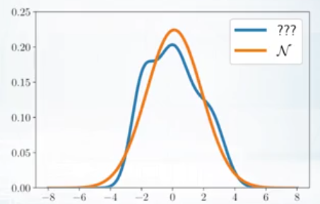
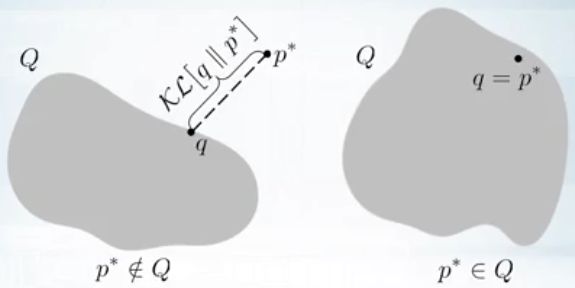
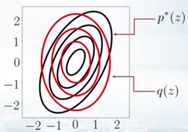
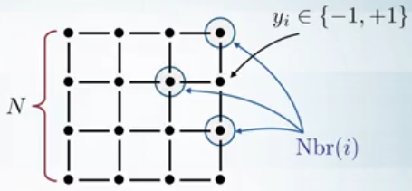
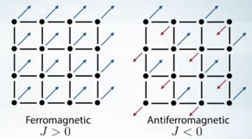
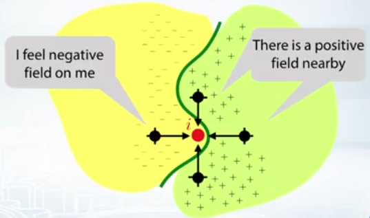
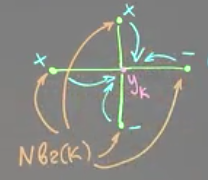
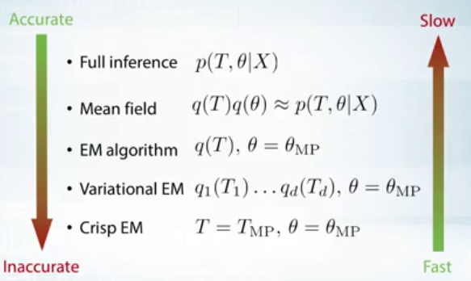

## Variational Inference & LDA

Les méthodes de Variational Bayesian (VB) sont une famille de technique qui permet de re-**écrire un problème de statistique inférentielle** (i.e. inférer une valeur d'une variable aléatoire selon la valeur d'une autre valeur aléatoire) **comme un problème d'optimisation**

L'algorithme dit de **Variational Inference** est un algorithme qui permet de calculer la distribution à Posteriori de façon approximative, mais voyons déjà pourquoi on a besoin de ce type de méthode.

On va se ramener aux mêmes problèmes qu'on a pu rencontrer avec EM, sur la difficulté de calculer la normalizing constant, quand on n'a pas de distribution conjugué à disposition.
$$
p^*(z) = p(z|X) = \frac{p(X|z)p(z)}{p(X)}
$$

**<u>Exemple 1:</u>** 

Un cas pratique où il est justement difficile de calculer cette distribution est avec le **Variational auto-encodeur**
$$
p(x|z) = \mathcal{N}(x|\mu(z), \sigma^2(z))
$$
Il faut aussi noter que nous avons ci-dessous en bleu la distribution à Posteriori qu'on pourrait dire empirique, qui découle de nos données, nous ne sommes pas obligés de la modéliser avec la plus grande précision. Ici, nous l'approximation par une loi normale qui a approximativement la même moyenne et écart type ce qui est suffisant.

**<u>Exemple 2:</u>** 

On va voir un exemple plus concret, $X$ peut représenter le "pixel brut des valeurs d'une image", tant dit que $Z$ est une valeur binaire tel que $Z=1$ "si $X$ est une image de chat"

X= P(Z=1) [c'est bien un chat]

X= P(Z=1) = 0.1 (ressemble à un chat)

**<u>Interprétation des paramètres:</u>** 

$p(Z|X)$ : "Etant donné l'image, quelle est la probabilité que ce soit un chat ?", si on peut échantillonner de $z \sim P(Z|X)$ , on peut faire un classifieur de chat. On dit que c'est un processus d' "encodage", il reconstruit les observations à partir de $z$

$p(X|Z)$ : "Etant donné une valeur de $Z$ on va calculer la probabilité que cette image est dans une des catégories, chat ou autre." Ce qui signifie qu'on pourra aussi générer des images $x \sim P(X|Z)$ de chats et de non-chats aussi facilement que la génération de nombre aléatoires. On dit que ce processus est un "décodeur" car il reconstruit les observations à partir de $z$ 

$P(Z)$ : Capture ce qu'on sait sur les données, ici on peut dire que si on sait que 1/3 des images sont des chats, alors $P(Z=1)= \frac{1}{3}$

**<u>Algorithme d'inférence Variationnelle:</u>** 

1. Sélectionner une famille de distribution $Q$ 

Exemple :
$$
\mathcal{N} \Big( \mu, 
A = \begin{pmatrix} 
    \sigma_1^2 &0  & &0\\
    0& \sigma_2^2 & & 0\\
     &  & \ddots\\
    0 & 0       & &\sigma_d^2 
    \end{pmatrix}
 \Big)
$$

2. On trouve la meilleur approximation $q(z) $ de $p^*(z )$ (qui est la distribution à Posteriori):

$$
\mathcal{KL[q(z) \| p^*(z)]} \rightarrow \underset{q \in Q}{min}
$$

**<u>Choix de la famille de variation (Variational family):</u>** 

En fonction des $q$ qu'on choisi on va obtenir différents résultats :

* SI $q$ est trop petit là vrais distribution à Posteriori ne sera pas dans son ensemble des valeurs. La distance entre les deux distributions celle qu'on cherche à approximer est la vrais sera calculé par la divergence  $\mathcal{KL}-divergence$
* Si le $q$ est plus grand on pourra égaliser les deux distributions, cependant, pour des $q$ plus grand il est plus difficile de calculer la variational inférence ($q$ est l'ensemble de toutes les distributions)

 **<u>Distribution non normalisé:</u>** 

Il y'a un problème dans cette approche, on ne pourra pas calculer le $p(X)$pour les mêmes raisons que d'habitude, mais, on va pouvoir utiliser une propriété de $\mathcal{KL}-divergence$ :
$$
p^*(z) = p(z|X) = \frac{p(X|z)p(z)}{p(X)} = \frac{\hat{p}(z)}{Z}
$$
On va définir la relation entre notre Variational Distribution et la Distribution à Posteriori non normalisé :
$$
\begin{align}
\mathcal{KL}\Big[ q(z) \| \frac{\hat{p}(z)}{Z} \Big] &= \int q(z) \cdot log \frac{q(z)}{\hat{p}(z)/Z} dz \\
&= \int q(z) \cdot log \frac{q(z)}{\hat{p}(z)} dz  + \underbrace{\int q(z)~log~Zdz}_{\int q(z)dz=1} \\
&= \mathcal{KL} \Big[ q(z) \| \hat{p}(z) \Big] + log~Z
\end{align}
$$
Vu qu'on cherche à résoudre un problème d'optimisation en fonction de $z $ on va pouvoir enlever la constante :
$$
\mathcal{KL} \Big[ q(z) \| \hat{p}(z) \Big]  \rightarrow \underset{z}{min}
$$
 **<u>Approximation Mean Field ou Variational Lower Bound:</u>** 

1. On choisit une famille de distributions $Q$ comme variational inference, c'est une distribution factorisable par les variables latentes

$$
Q = \{ q~ | ~ q(z) = \prod_{i=1}^{d} ~q_i(z_i) \}
$$

2. On va trouver la meilleure approximation entre la variational distribution $q(z)$ et la vrais Distribution à Posteriori $p^*(z)$:

$$
\mathcal{KL} \Big[ q(z) \| p^*(z) \Big]  \rightarrow \underset{z}{min}
$$

<u>*Exemple:*</u>

On va considérer que la vrais distribution suit une loi normale de matrice de covariance pleine et on l'approximera par une loi à matrice de covariance diagonale.
$$
p^*(z_1, z_2) \approx q_1(z_1) q_2(z_2) \\
p^*(z_1, z_2) = \mathcal{N}(0,\Sigma) \\
q_1(z_1)q_2(z_2) = \mathcal{N}(0, \begin{pmatrix} \sigma_1^2 & 0 \\ 0 & \sigma_2^2\end{pmatrix})
$$
Ce qui graphiquement nous donnera cette Gaussienne en rouge qui est centré

<u>*L'algorithme:*</u>

Dans l'algorithme on commencera par optimiser avec $q_1$, on aura une nouvelle distribution on réoptimisera avec $q_2$ etc. jusqu'à convergence
$$
\mathcal{KL} \Big[ q(z) \| \hat{p}(z) \Big] = \mathcal{KL}(\prod_{i=1}^{d}q_i ~\|~ p^*) \rightarrow \underset{q_1,q_2,...,q_d}{min}
$$
On va appliquer l'algorithme de Coordinate descend :
$$
\begin{align}
&1.~~~~ \mathcal{KL}(q~ \|~p^*) \rightarrow \underset{q_1}{min} \\
&2.~~~~ \mathcal{KL}(q~ \|~p^*) \rightarrow \underset{q_2}{min} \\
&3.~~~~ ...
\end{align}
$$
On va maintenant effectuer des calculs afin de calculer l'approximation Mean-Field, on va sortir le produit du logarithme, on changera l'indexe du multiplicateur à l'intérieur de l'intégrale
$$
\begin{align}
& \mathcal{KL}(\prod_{i=1}^{d}q_i ~\|~ p^*) \rightarrow \underset{q_k}{min} \\
&\int \prod_{i=1}^{d} q_i ~ log \frac{\prod_{i=1}^{d}q_i}{p^*}dz \\
&= \sum_{i=1}^{d} \int \prod_{j=1}^{d} q_j~ log(q_i)~ dz - \int \prod_{j=1}^{d} q_j~log(p^*)dz \\
&= \int \prod_{j=1}^{d} q_j ~log(q_k) dz + \sum_{i \neq k} \int \prod_{j=1}^{d} q_j~log(q_i)dz - \int \prod_{j=1}^{d} q_j ~ log(p^*)dz
\end{align}
$$
On va maintenant voir quels termes sont constant par rapport à $q_k $
$$
\begin{align}
&= \int q_k ~ log~q_k \underbrace{\Big[ \int \prod_{j \neq k} q_j ~dz_{\neq k}  \Big]}_{=1}dz_k + \underbrace{cst}_{ne~dépend~pas~de~k} \\
& = \int q_k ~ log~q_k~dz_k - \int q_k \Big[ \int \prod_{i \neq k} q_j~log~p^*~dz_{ \neq k}\Big] dz_k + cst\\

& =  \int q_k \Big[log~q_k - \underbrace{\int \prod_{j \neq k} q_j ~log~p^*~d_{z \neq k} \Big]}_{h(z_k)=\mathbb{E}_{q_{-k}}log~p^*} dz_k + cst
\end{align}
$$
On va définir une nouvelle distribution :
$$
t(z_k) = \frac{e^{h(z)}}{\int e^{h(z'_k)dz_k}}
$$
On reprend le calcul :
$$
\begin{align}
&= \int q_k ~log \frac{q_k}{t}dz_k + cst \rightarrow min \\
&\mathcal{KL[q_k \| t]} \rightarrow min \\
& q_k = t => log~q_k = \mathbb{E}_{q_{-k}}log~p^* +cst 
\end{align}
$$

 **<u>Exemple : Le modèle de Ising</u>** 

Nous avons un modèle de treillis à deux dimensions, chacun de ces éléments sont des variables qui peuvent prendre des valeurs de $+1$ ou de $-1$ :
$$
y_i \in \{-1,+1 \}
$$
Nous aurons aussi besoin d'une fonction $Nbr(i) $ qui retourne l'ensemble des points voisins

On définit la probabilité jointe de la façon suivante :
$$
p(y) \approx \underbrace{exp \Big( \frac{1}{2} J \sum_i \sum_{j \in Nbr(i)} y_i y_j +\sum_i b_i y_i \Big)}_{\phi(y)}
$$
On va calculer les sommes de toutes les arêtes, et le produit de deux variables aléatoires, si les noeuds voisins ont le même signes ils retourneront 1. On a aussi un **second terme**, qu'on appelle, **external field**,  sur tous les nœuds du treillis

<u>*Interprétation:*</u>

Si $J \gt 0$ les nœuds auront tendance à avoir le même signe, on peut interpréter les $y_i $ comme des "pins d'atoms"

<u>*Normalizing constant:*</u>

Comme d'habitude on va avoir le problème, que pour la constante de normalisation il faudra calculer toutes les combinaisons possibles, ce qui est beaucoup trop.
$$
p(y) = \frac{1}{Z} \phi(y) \\
Z = \sum_y \phi(y) \rightarrow 2^{N^2}~termes
$$
On va donc passer par une approximation Mean-Field pour résoudre ce problème, un produit d'un ensemble de termes :
$$
p(y) \approx q(y) = \prod_i q_i(y_i)
$$
Voyons un exemple, on à quatre noeuds avec un noeud centrale en plus $i$ , le external field parémétrisé par $b$ est montré ici comme les aires en jaunes et verts, dans la zone jaune il y'a un fort champs négatif, et dans celui en vert un champ positif

<u>*Démonstration par Mean-Field:*</u>

Les valeurs + et - de chaque noeud sont dans la variable $b $ , on va vouloir voir l'impact de chaque noeud sur le centrale $y_k $ et on va vouloir calculer la formule du Mean-Field qui est $q(y_k)$

On va repartir de la formule qu'on avait vu :
$$
\begin{align}
log~q_k &= \mathbb{E}_{q_{-k}}~log~p +cst \\
&= \mathbb{E}_{q_{-k}} \Big[J \sum_{j \in Nbr(k)}y_ky_j + b_k y_k \Big] \\
&= J \sum_{j \in Nbr(k)} \underbrace{\mathbb{E}y_j}_{\mu_j} + b_k y_k+cst \\
&= y_k \Big(\underbrace{ J \sum_{j \in Nbr(k)}\mu_j + b_k}_{M} \Big) +cst
\end{align}
$$
Maintenant on veut estimer la distribution $q_k$ et on sait que ça dépend d'une constante, on peut prendre l'exponentielle de chaque côté et de plus :
$$
\begin{align}
q_k(+1) + q_k(-1) &= 1 \\
c \cdot e^M + c \cdot e^{-M} &= 1 \\
c = \frac{1}{e^M + e^{-M}} \\
q_k(+1) = \frac{e^M}{e^M + e^{-M}} &= \frac{1}{1 + e^{-2M}} = \underbrace{\sigma(2M)}_{fct~sigmoïde} \\
\mu_k  = q_k(+1)-q_k(-1) &= \frac{e^M - e^{-M}}{e^M + e^{-M}} = tanh(M)
\end{align}
$$
<u>*Exemple:*</u>

index 2

 **<u>Le modèle Variational Inference</u>** 

comments

E-step :
$$
\mathcal{KL}[q(T) \| p(T | X, \theta)] \rightarrow \underset{q}{min}
$$
Full posterior :
$$
q(T) = p(T | X, \theta)
$$
Variational Inference :
$$
\mathcal{KL}[q(T) \| p(T | X, \theta)] \rightarrow \underset{q \in Q}{min}
$$
On peut utiliser ici une mean field approximation pour résoudre ce problème, cette variational Inference est appelé Variational EM

 **<u>Résumé des modèles :</u>** 

* Pour le modèle Mean Field on aura une approximation de la distribution à Posteriori
* pour l'algorithme EM, on fera une approximation du paramètre en utilisant le MLE (on aura donc pas forcément le maximum globale).
*  Dans Variational EM, on peut utiliser une approximation Mean-Field et on factorise les probabilités sur les variables latentes avec une estimation ponctuelle des paramètres. 
* Si on les algorithmes précédents sont toujours trop long, on peut passer par du Crisp EM, qui fera une estimation ponctuelle des paramètres et la distribution latente, cette méthode est utilisé pour l'approximation de K-means.

Notes:

https://www.cs.cmu.edu/~epxing/Class/10708-17/notes-17/10708-scribe-lecture13.pdf

http://bjlkeng.github.io/posts/variational-bayes-and-the-mean-field-approximation/

https://blog.evjang.com/2016/08/variational-bayes.html

https://medium.com/intuitionmachine/navigating-the-unsupervised-learning-landscape-951bd5842df9